# ACPLogAnalyzer
## Log analyzer tool for ACP

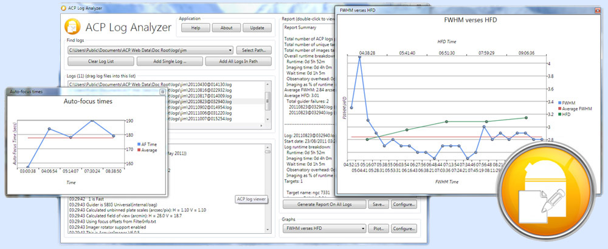

The ACP Log Analyzer app provides a quick and easy mechanism for generating an informational report on your
ACP-based observing activities. This can be for the previous evening, the last month, or as long as you've been using ACP
(and have the log files related to your observing sessions).

ACP Log Analyzer makes it easy to find out, for example, what your average pointing error is when slewing to objects,
what your average FWHM is, how many plate solves failed, how many times an auto-focus run succeeded/failed, etc. This can
be done for a single log or for many hundreds, and you can view summarized information about each log and/or overall
results for the entire set of log files. And ACP Log Analyzer works quickly too, normally completing in a few seconds or
less, even when parsing several hundred logs.

<h3>Will it damage my logs?!</h3>

    

        No, ACP Log Analyzer simply <em>reads</em> the contents of one or more of your ACP logs (which are just text files with a .log extension),
        analyzes the text and outputs a summary of the information found. At no time is the contents of any log file altered.
    

    

## How to install ACP Log Analyzer
ACP Log Analyzer is a Microsoft Windows application and uses a standard Windows installer to install the application.
Simply download the latest version of the installer (ACPLogAnalyzerSetup.msi) from **Help/\_files** and save it to a temporary
location on your hard disk. Double-click the installer and follow the on-screen instructions.

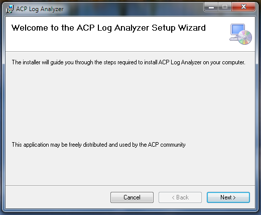

When installation is complete, a new folder containing a link to launch the ACP Log Analyzer will have been created in your
**Start | All Programs</em> menu**:

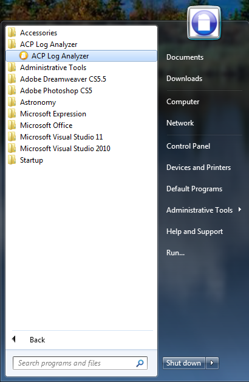

## How to remove ACP Log Analyzer
To remove the application, use the Windows Control Panel (e.g. Programs & Features in Windows 7) to uninstall it.

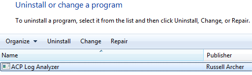

## How to use ACP Log Analyzer
When you first run the application you'll see the following:

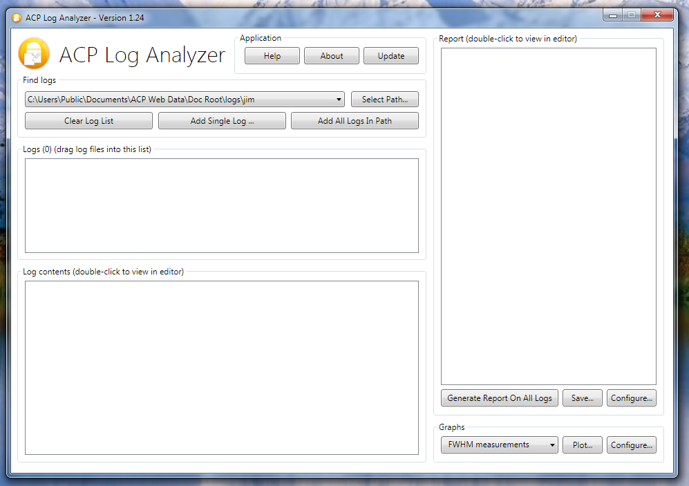    

The first thing to do is tell ACP Log Analyzer which logs to work on. This can be done in a number of ways.
The first way is to **Drag & Drop** one or more files and/or folders from Windows Explorer into the **Logs** list:

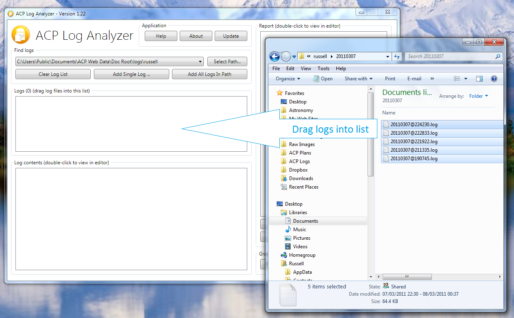

Another alternative is to click the **Add Single Log** button. This allows you to select a single log file.

You may also click the **Add All Logs In Path** button. In this case, ACP Log Analyzer will search the folder
structure specified in the path bar for ACP logs.

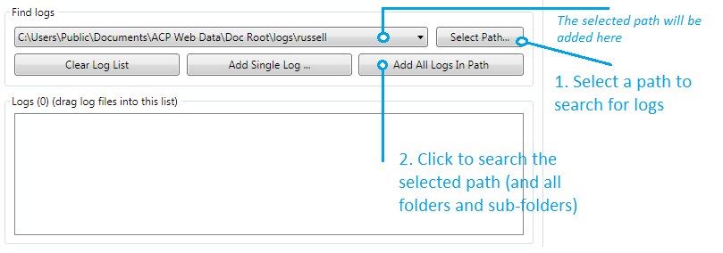

Note that whatever method you choose, all logs are briefly examined to determine if they are valid ACP logs (lots of applications
produce logs with a .log extension). Non-ACP logs are rejected.

The contents of a log may be viewed in your default text editor (e.g. Notepad.exe) by double-clicking either the log contents
window, or, by double-clicking any item in the list of logs.

If required, you may remove a log from the list by right-clicking it, and then selecting **Remove log from list**
from the popup menu:

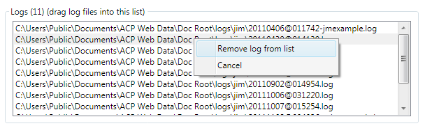

## Generating a report
You are now ready to create a report. Simply select (click on) a log in the list or click the **Generate Report On All Logs**
button. Whatever method you choose, the report appears in the right-most panel in ACP Log Analyzer:

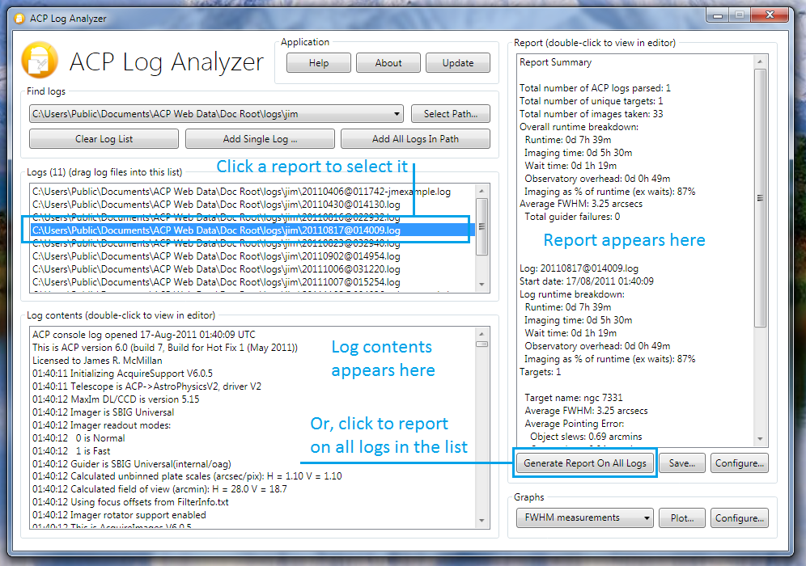

The contents of a report may be saved to disk by clicking the **Save Report** button. You may also view it in your default
text editor by double-clicking on the report.

## Report configuration details
The content of a report may be modified by clicking the report **Configure** button:

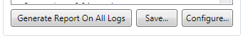

The **Configure Report** window allows you to control which items appear in report output:

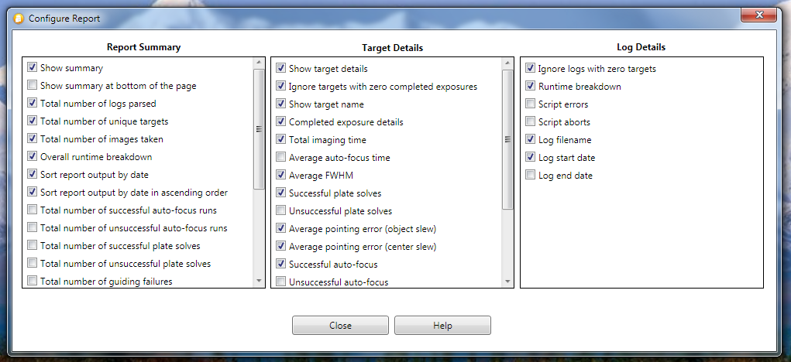

The following describes each report property in detail.

### Report Summary Properties
Show summary
Shows the report summary if checked, otherwise the summary is not displayed.

Show summary at bottom of the page
Shows the summary at the bottom of the report if checked, otherwise the summary will be at the top.

Total number of logs parsed
Shows the total number of valid ACP logs parsed. Logs are inspected when they are added to the log list to confirm they are valid ACP logs
(lots of applications use the .log file extension).

Total number of unique targets
The overall (for all logs) count of unique observing targets.

Total number of images taken
The overall count of successfully completed exposures. This number does not include pointing exposures, auto-focus
exposures, etc.

Overall runtime breakdown
Provides an overall time-based breakdown of observing activities. This includes
**imaging time** (the time spent actively taking exposures),
**wait time** (time spent waiting for certain conditions , e.g. plan wait statements such as #WAITFOR, #WAITUNTIL, etc.),
**observatory overhead** (all other time not included in the other categories),
**imaging as % of runtime** (shows the percentage of time spent usefully taking images).

Sort report output by date
Sorts report output by date if checked.

Sort report output by date in ascending order
Sorts the output in ascending order if checked, otherwise output is sorted in descending order.

Total number of successful auto-focus runs
The overall count of successfully completed auto-focus runs.

Total number of unsuccessful auto-focus runs
The overall count of auto-focus runs which did not complete successfully.

Total number of successful plate solves
The overall count of successfully completed plate solve operations.

Total number of unsuccessful plate solves
The overall count of failed plate solve operations.

Overall guider failure/unguided imaging count
The overall count of failed auto-guiding operations.

Overall successful all-sky plate solve count
The overall count of successful all-sky plate solve operations (new in 1.32, ACP 7).

Overall unsuccessful all-sky plate solve count
The overall count of unsuccessful all-sky plate solve operations (new in 1.32, ACP 7).

Overall guider failure/unguided imaging brkdn
Show a breakdown of the log, target and time when the guiding failed (and imaging of a target(not an auto-focus target)
continued unguided).

Overall average FWHM
The overall average FWHM for all target images taken in all logs. FWHM measurements only include data for successful
plate-solves on imaging targets (e.g. pointing update FWHM's are ignored).

Overall average HFD
The overall average HFD as reported by FocusMax for all target images taken in all logs. Only applies to successful
AF runs

Overall average pointing error (object slew)
The overall average pointing error following a slew to a target. This includes imaging targets,
auto-focus targets, returns from auto-focusing, etc.

Overall average pointing error (center slew)
The overall average pointing error following a slew to center an object in the FoV.

Overall average auto-focus time
The overall average time taken to successfully complete an auto-focus (failed attempts are ignored).
This does not include slew time to target stars. This value is a measure of the time from when ACP
hands control to FocusMax until control passes back to ACP.

Overall average guider start-up time
The overall average time taken for the guider to successfully start (failed starts are ignored),

Overall average guider settle time
The overall average time taken for the guider to successfully settle (failed attempts are ignored).

Overall average filter change time
The overall average time taken for filter changes (the results for all filters are combined).

Overall average pointing exp/plate solve time
The overall average time taken to successfully complete the process to take a pointing exposure and
solve the resulting image (failed attempts are ignored).

Overall average slew time (targets)
The overall average time taken to slew to observing targets (all other types of slews are ignored).

Overall average all-sky plate solve time
The overall average time taken to successfully complete all-sky plate solves <em>(new in 1.32, ACP 7).

### Per-Target Details Properties
Show target details
Displays target details if checked, otherwise all target details are not displayed (although the
details of the target are included in other statistics and calculations).

Ignore targets with zero completed exposures
If checked, targets where no images have been successfully taken are ignored (not displayed).

Show target nameShows the target's name if checked.

Completed exposure details
Displays a breakdown of successfully completed exposures, including imaging time, number of images
for each filter and binning levels.

Total imaging time
Displays the total time spent imaging this target.

Average auto-focus timeDisplays the average time spent auto-focusing on this target on this target.

Average FWHM
Displays the average FWHM for this target.  FWHM measurements only include data for successful
plate-solves on imaging targets (e.g. pointing update FWHM's are ignored).

Average HFDDisplays the average HFD as reported by FocusMax for all target images in the selected log.
Only applies to successful AF runs.

Successful plate solvesDisplays the total number of successful plate solves for this target.

Unsuccessful plate solves
Displays the total number of unsuccessful plate solves for this target.

Successful all-sky plate solves
Displays the total count of successful all-sky plate solve operations for this target
(new in 1.32, ACP 7).

Unsuccessful all-sky plate solves
Displays the total count of unsuccessful all-sky plate solve operations for this target
(new in 1.32, ACP 7).

Average pointing error (object slew)
Displays the average pointing error following a slew to a target. A 'target' is defined as an actual
imaging target, an auto-focus star and returns to an imaging target from auto-focusing.

Average pointing error (center slew)
Displays the average pointing error following a slew to center this target in the FoV.

Successful auto-focus
Displays a count of the number of successful auto-focus runs for this target.

Unsuccessful auto-focus
Displays a count of the number of unsuccessful auto-focus runs for this target.

Guider failure/unguided imaging count
Displays a count of the number of times guiding failed (and an exposure proceeded unguided)
for this target.

Guider failure/unguided imaging breakdown
Shows a breakdown of when guiding failed for this target.

Average guider start-up time
Displays the average time taken for the guider to successfully start while imaging this target
(failed starts are ignored).

Average guider settle time
Displays the average time taken for the guider to settle while imaging this target
(failed starts are ignored).

Average filter change time
Displays the average time taken for filter changes while imaging this target (the results for all
filters are combined).

Average pointing exposure/plate solve time
Displays the average time taken to successfully complete the process to take a pointing exposure
for this target and solve the resulting image (failed attempts are ignored).

Average slew time (targets)
Displays the average time taken to slew to this target (all other types of slews are ignored).

Average all-sky plate solve time
Displays the average time taken to successfully complete all-sky plate solves (new in 1.32, ACP 7).

### Log Details Properties
Ignore logs with zero targets
If checked, logs with no targets are ignored (they are not displayed and all their properties
are excluded from other statistics and calculations).

Runtime breakdown
Shows a time-based breakdown of log activity if checked, otherwise the breakdown is not displayed.

Script errors
Shows a count of script errors if checked.

Script aborts
Shows a count of scripts that were aborted by the user if checked.

Log filename
Displays the log's filename (excluding the path) if checked.

Log start date
Displays the log's start date/time if checked.

Log end date
Displays the log's end date/time if checked.

## Generating a graph
Log Analyzer allows you to generate 22 different types of graph that plot data points for key observing activities.
Simply select the required graph type and click **Plot**:

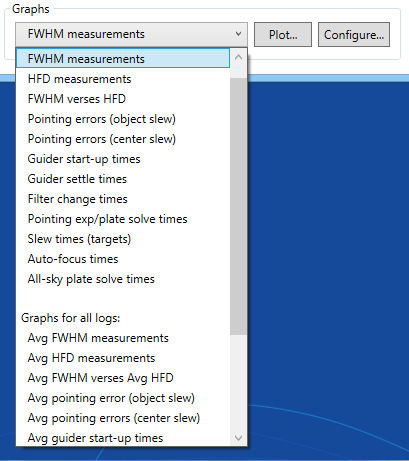

The graph appears in a floating window, which you can move and resize as required. If you resize the window the
graph will rescale to take maximum advantage of available space. When you are finished reviewing the graph you
may either close the window or leave it open (perhaps to compare with another graph - you may have as many
graph windows open as you like):

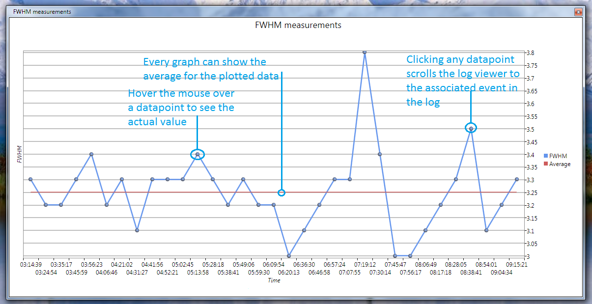

The available graphs types are as follows:

* All FWHM measurements for the current log
* All HFD measurements for the current log
* A comparision of FWHM verses HFD measurements for the current log
* All pointing errors (object slew) for the current log
* All pointing errors (center slew) for the current log
* All guider start-up times for current log
* All guider settle times for current log
* All filter change times for current log
* All pointing exposure/plate solve times for the current log
* All slew times (targets) for the current log
* All-sky plate solve times for current log (new in 1.32, ACP 7)

* Average FWHM measurements for all logs
* Average HFD measurements for all logs
* A comparision of average FWHM verses HFD measurements for all logs
* Average pointing error (object slew) for all logs
* Average pointing errors (center slew) for all logs
* Average guider start-up times for all logs
* Average guider settle times for all logs
* Average filter change times for all logs
* Average pointing exposure/plate solve times for all logs
* Average slew times (targets) for all logs
* Average times for successful all-sky plate solves for all logs (new in 1.32, ACP 7)

Every graph displays an **average line**, indicating the average value for all the graph's data points.
This line can be hidden by right-clicking anywhere on the graph and selecting **Hide Average**:

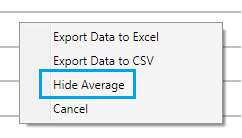

If the average line is hidden, it may be re-displayed by right-clicking anywhere on the graph and selecting
**Show Average**:

You may **Export** the data from any graph by right-clicking on the graph and selecting
one of the export options presented in the popup menu:

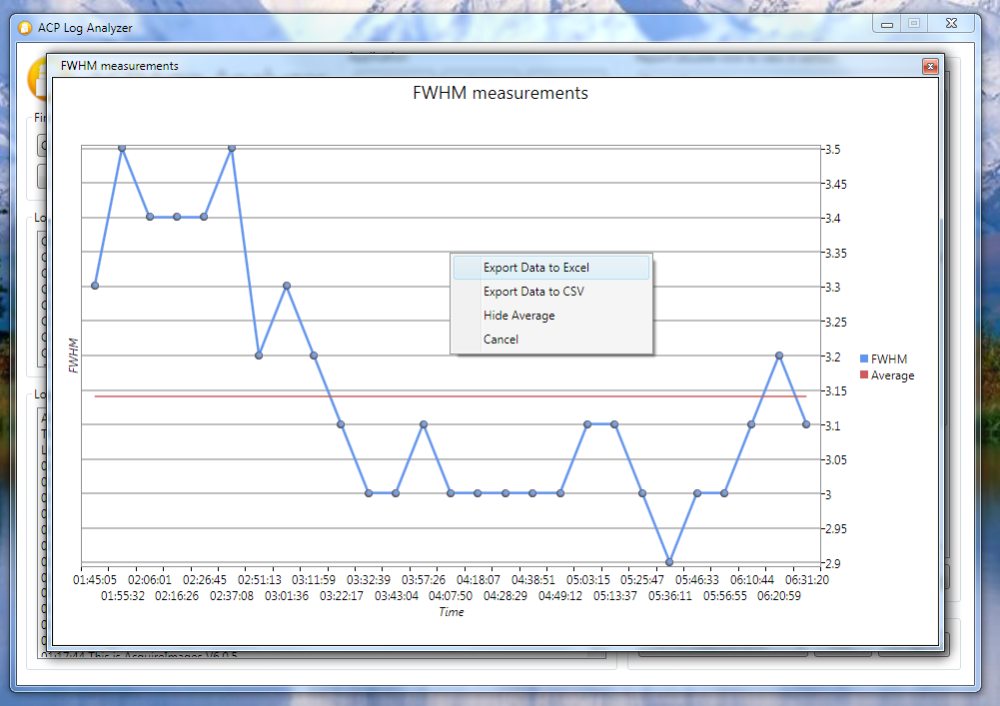

Selecting **Export Data to CSV** creates a comma-separated-variable text file, which is in a suitable format for opening with
Excel, Access, and many other commercial applications.

Selecting **Export Data to Excel** opens Excel (you must have this installed on your computer) and then
adds the required data to a blank sheet. You may then create graphs of your data using the more comprehensive features in Excel:

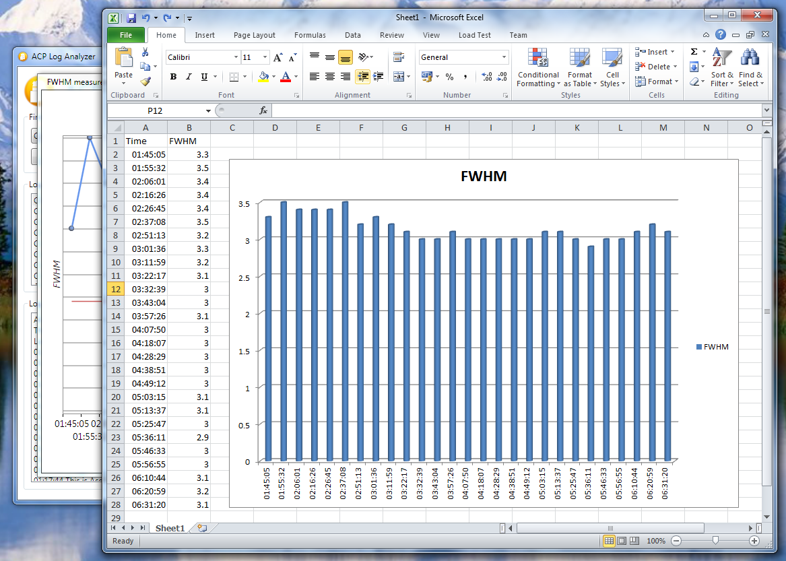

Clicking on any data-point (except on the average line) scrolls the log contents window to highlight
the relevant event. This is only available for single-log graphs (i.e. graphs showing overall averages from multiple
logs do not have associated single events).

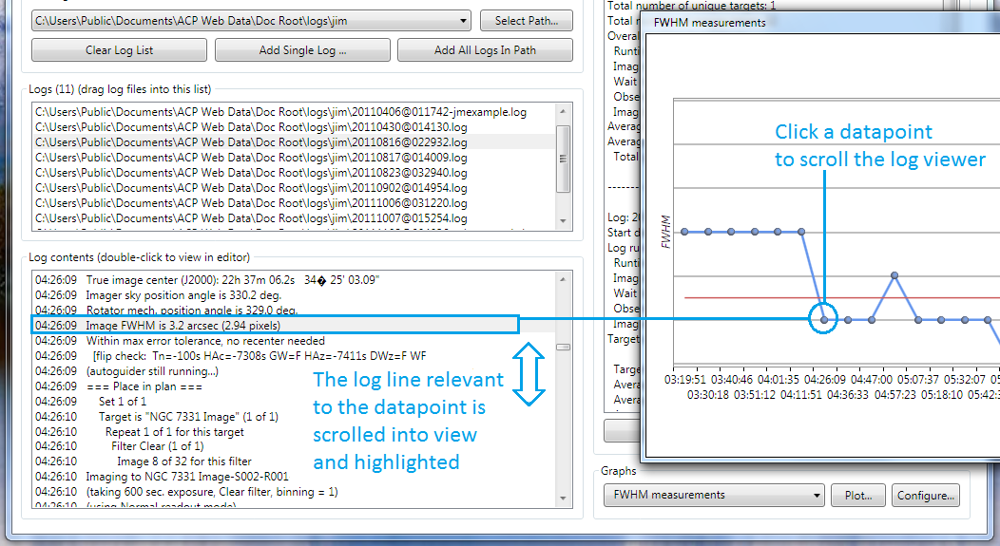

## Changing the look of graphs
Log Analyzer allows you to change the way your graphs look. Click the **Configure** button:

The **Configure Graph Plot** window appears. Graph configuration properties are arranged in six tabs,
with the **Text** tab being selected initially by default:

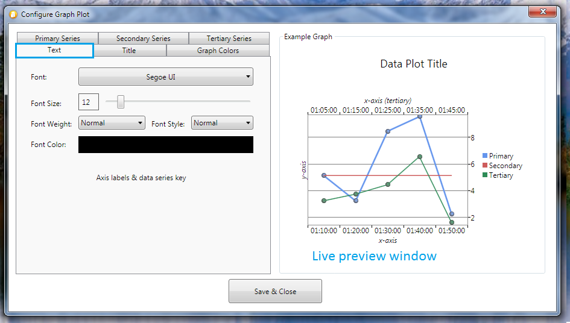

The **Text** tab allows you to change the appearance of all text on the graph (legend, axis, etc.), except the title
(see the **Title** tab). As you make changes to the font, size, color, etc., notice that the example graph
updates to show you what your finished graph will look like.

The **Title** is similar in layout to the Text tab. Here you can set the look of the graph title, which appears
at the top of the window:

The **Graph Colors** tab allows you to change the background color of the graph. You can also change the
background color of the graph legend:

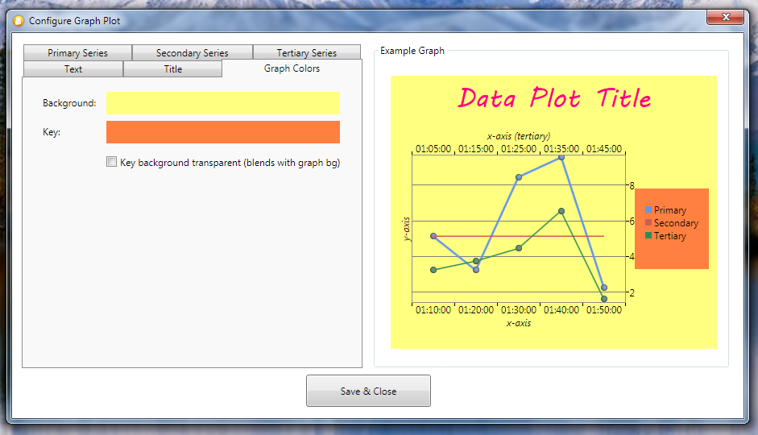

The **Primary Series** tab allows you to change the properties of the primary data series.
You can configure the thickness of the graph line, its color, and if you want individual data points to be shown or not.
Note that if you turn data points off, you will no longer be able to hover the mouse over the graph to see individual values:

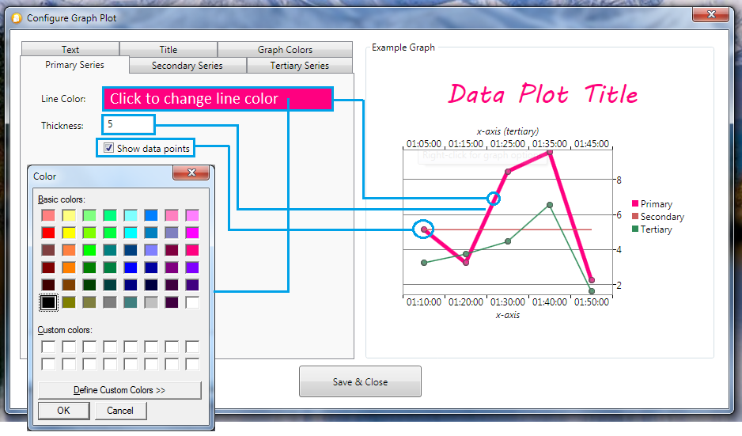

The **Secondary Series** and **Tertiary** (third) **Series** tabs are similar in layout to the **Primary Series** tab.
They allow you to change the properties of the secondary (i.e. **graph average**) and tertiary (e.g. **HFD** on the **FWHM v HFD**
graph) data series:

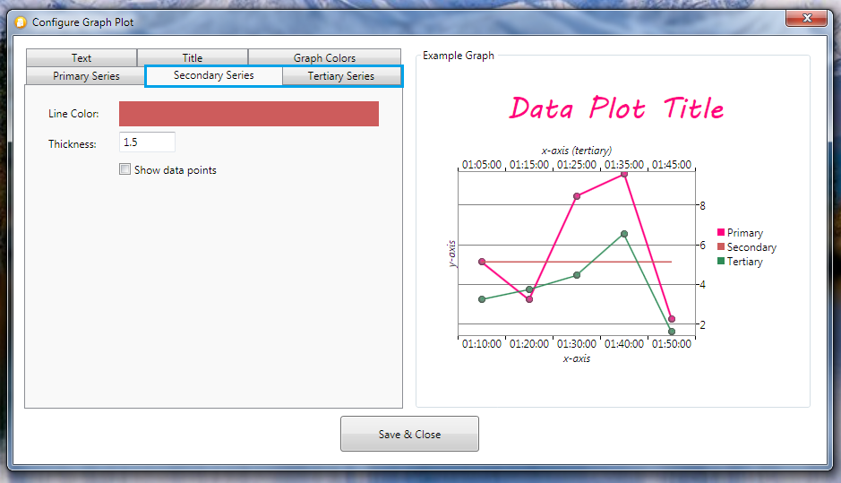

## Program updates
ACP Log Analyzer automatically checks to see if you are running the latest version. If an update is available
you will be asked if you wish to download and install it:

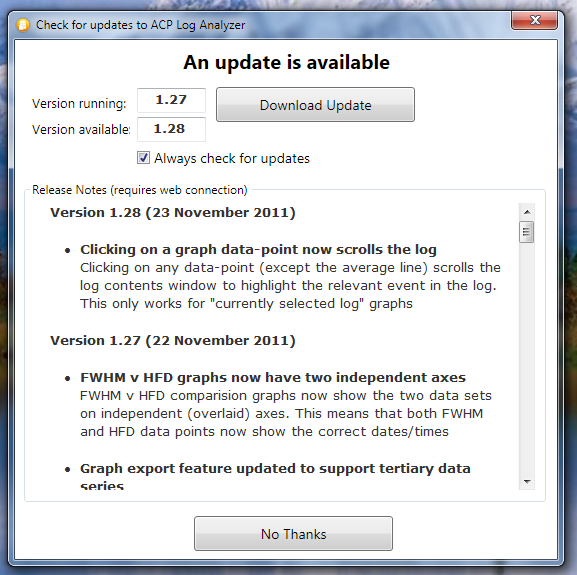

You can either start the download by clicking **Download Update** or defer the upgrade by clicking **No Thanks**.
The next time the application runs you will be reminded about the available update.

To prevent the application checking for updates, uncheck **Always check for updates**.

If you decide to proceed with the update, download progress is displayed:

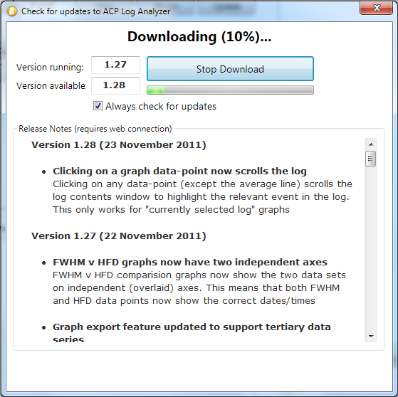

When the download is complete you will be asked if you wish to install the update now:

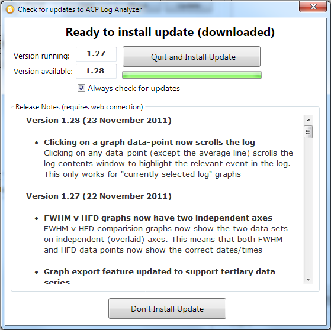

You can opt to install the update, in which case the application will close and the installation of the upgrade will begin.
Alternatively, you can defer the installation by clicking **Don't Install Update**. You will be prompted to install
the previously downloaded update the next time you run the application.

## Log Parsing Rules
In order that the process used by ACP Log Analyzer when interpreting ACP log files may be transparent
and open to review and feedback, we present here a simplified version of the parsing rules employed by Analyzer.

<table>
    <tr><td width="150px"><strong>Event</strong></td>
    <td width="850px">Imaging target</td></tr>

    <tr><td><strong>Start Trigger</strong></td>
    <td>"starting target"</td></tr>

    <tr><td><strong>End Trigger</strong></td>
    <td>"starting target"</td></tr>

    <tr><td><strong>Exclusions</strong></td>
    <td>-</td></tr>

    <tr><td><strong>Notes</strong></td>
    <td>A new target triggers the end of the previous target</td></tr>
</table>

<table>
    <tr><td width="150px"><strong>Event</strong></td>
    <td width="850px">Target imaging exposure</td></tr>

    <tr><td><strong>Start Trigger</strong></td>
    <td>"imaging to"</td></tr>

    <tr><td><strong>End Trigger</strong></td>
    <td>"taking"</td></tr>

    <tr><td><strong>Exclusions</strong></td>
    <td>-</td></tr>

    <tr><td><strong>Notes</strong></td>
    <td>-</td></tr>
</table>

<table>
    <tr><td width="150px"><strong>Event</strong></td>
    <td width="850px">FWHM measurement</td></tr>

    <tr><td><strong>Start Trigger</strong></td>
    <td>"image fwhm is"</td></tr>

    <tr><td><strong>End Trigger</strong></td>
    <td>"imaging to"</td></tr>

    <tr><td><strong>Exclusions</strong></td>
    <td>Pointing update exposure FWHMs</td></tr>

    <tr><td><strong>Notes</strong></td>
    <td>Only imaging exposure FWHMs are recorded (pointing exposure FWHMs are excluded)</td></tr>
</table>

<table>
    <tr><td width="150px"><strong>Event</strong></td>
    <td width="850px">Auto-focus time measurement</td></tr>

    <tr><td><strong>Start Trigger</strong></td>
    <td>"start slew to autofocus"</td></tr>

    <tr><td><strong>End Trigger</strong></td>
    <td>"autofocus finished" + successful final plate solve</td></tr>

    <tr><td><strong>Exclusions</strong></td>
    <td>
        Center slew operations 
        FocusMax reports a failure 
        Plate-solve failure (for any reason)
    </td></tr>

    <tr><td><strong>Notes</strong></td>
    <td>
        AF time measurement includes:
        

        Time to slew to the AF target 
        Acquiring the AF star (includes a possible plate solve by FocusMax) 
        The actual focusing process handled by FocusMax 
        Re-slew back to the original target 
        Pointing update/slew
        

        Only auto-focus runs which result in successful plate-solves are included in the result set
    </td></tr>
</table>

<table>
    <tr><td width="150px"><strong>Event</strong></td>
    <td width="850px">Pointing error measurement (object slew)</td></tr>

    <tr><td><strong>Start Trigger</strong></td>
    <td>"start slew to"</td></tr>

    <tr><td><strong>End Trigger</strong></td>
    <td>"(slew complete)" + successful final plate solve</td></tr>

    <tr><td><strong>Exclusions</strong></td>
    <td>
        Anytime "start slew to" is immediately preceded by "re-slew to target" (this is a 'center' slew) 
        Plate-solve failure (for any reason)
    </td></tr>

    <tr><td><strong>Notes</strong></td>
    <td>
        For our purposes an 'object' slew is defined as:
        

        Slews to imaging targets (e.g M57, etc.) 
        Slews to auto-focus targets 
        Return slews from AF targets
        

        Only slews which result in successful plate-solves are included in the result set
    </td></tr>
</table>

<table>
    <tr><td width="150px"><strong>Event</strong></td>
    <td width="850px">Pointing error measurement (center slew)</td></tr>

    <tr><td><strong>Start Trigger</strong></td>
    <td>"Re-slew to target"</td></tr>

    <tr><td><strong>End Trigger</strong></td>
    <td>"(slew complete)"</td></tr>

    <tr><td><strong>Exclusions</strong></td>
    <td>
        Anytime "re-slew to target" is immediately followed by "start slew to autofocus"  
        (there should be no plate-solve after re-slew to a focus star) 
        Plate-solve failure (for any reason) 
    </td></tr>

    <tr><td><strong>Notes</strong></td>
    <td>
        Only slews which result in successful plate-solves are included in the result set
    </td></tr>
</table>

<table>
    <tr><td width="150px"><strong>Event</strong></td>
    <td width="850px">Slew (to target) time</td></tr>

    <tr><td><strong>Start Trigger</strong></td>
    <td>"start slew to"</td></tr>

    <tr><td><strong>End Trigger</strong></td>
    <td>"slew complete"</td></tr>

    <tr><td><strong>Exclusions</strong></td>
    <td>
        Anytime "start slew to" is immediately preceded by "re-slew to target" (this is a 'center' slew) 
        Plate-solve failure (for any reason) 
        Pointing update, re-slew to target or start of slew to new target found while looking for slew completion time
    </td></tr>

    <tr><td><strong>Notes</strong></td>
    <td>
        Only slews which result in successful plate-solves are included in the time result set
    </td></tr>
</table>

<table>
    <tr><td width="150px"><strong>Event</strong></td>
    <td width="850px">Plate solve count</td></tr>

    <tr><td><strong>Start Trigger</strong></td>
    <td>"solved!"</td></tr>

    <tr><td><strong>End Trigger</strong></td>
    <td>-</td></tr>

    <tr><td><strong>Exclusions</strong></td>
    <td>
        -
    </td></tr>

    <tr><td><strong>Notes</strong></td>
    <td>
        -
    </td></tr>
</table>

<table>
    <tr><td width="150px"><strong>Event</strong></td>
    <td width="850px">Plate solve error count</td></tr>

    <tr><td><strong>Start Trigger</strong></td>
    <td>
        Any of:
        

        "plate solve error!" 
        "no matching stars found" 
        "solution is suspect"
    </td></tr>

    <tr><td><strong>End Trigger</strong></td>
    <td>-</td></tr>

    <tr><td><strong>Exclusions</strong></td>
    <td>
        -
    </td></tr>

    <tr><td><strong>Notes</strong></td>
    <td>
        -
    </td></tr>
</table>

<table>
    <tr><td width="150px"><strong>Event</strong></td>
    <td width="850px">Successful auto-focus count and HFD value</td></tr>

    <tr><td><strong>Start Trigger</strong></td>
    <td>"auto-focus successful!"</td></tr>

    <tr><td><strong>End Trigger</strong></td>
    <td>HFD = {value}</td></tr>

    <tr><td><strong>Exclusions</strong></td>
    <td>
        -
    </td></tr>

    <tr><td><strong>Notes</strong></td>
    <td>
        -
    </td></tr>
</table>

<table>
    <tr><td width="150px"><strong>Event</strong></td>
    <td width="850px">Auto-focus failure count</td></tr>

    <tr><td><strong>Start Trigger</strong></td>
    <td>"autofocus failed"</td></tr>

    <tr><td><strong>End Trigger</strong></td>
    <td>-</td></tr>

    <tr><td><strong>Exclusions</strong></td>
    <td>
        -
    </td></tr>

    <tr><td><strong>Notes</strong></td>
    <td>
        -
    </td></tr>
</table>

<table>
    <tr><td width="150px"><strong>Event</strong></td>
    <td width="850px">Script error count</td></tr>

    <tr><td><strong>Start Trigger</strong></td>
    <td>"script error" </td></tr>

    <tr><td><strong>End Trigger</strong></td>
    <td>-</td></tr>

    <tr><td><strong>Exclusions</strong></td>
    <td>
        -
    </td></tr>

    <tr><td><strong>Notes</strong></td>
    <td>
        -
    </td></tr>
</table>

<table>
    <tr><td width="150px"><strong>Event</strong></td>
    <td width="850px">Script abort count</td></tr>

    <tr><td><strong>Start Trigger</strong></td>
    <td>"script was aborted"</td></tr>

    <tr><td><strong>End Trigger</strong></td>
    <td>-</td></tr>

    <tr><td><strong>Exclusions</strong></td>
    <td>
        -
    </td></tr>

    <tr><td><strong>Notes</strong></td>
    <td>
        -
    </td></tr>
</table>

<table>
    <tr><td width="150px"><strong>Event</strong></td>
    <td width="850px">Guider start-up time</td></tr>

    <tr><td><strong>Start Trigger</strong></td>
    <td>"trying to autoguide"</td></tr>

    <tr><td><strong>End Trigger</strong></td>
    <td>"autoguiding at"</td></tr>

    <tr><td><strong>Exclusions</strong></td>
    <td>
        -
    </td></tr>

    <tr><td><strong>Notes</strong></td>
    <td>
        -
    </td></tr>
</table>

<table>
    <tr><td width="150px"><strong>Event</strong></td>
    <td width="850px">Guider settle time</td></tr>

    <tr><td><strong>Start Trigger</strong></td>
    <td>"guider check ok"</td></tr>

    <tr><td><strong>End Trigger</strong></td>
    <td>"imaging to"</td></tr>

    <tr><td><strong>Exclusions</strong></td>
    <td>
        -
    </td></tr>

    <tr><td><strong>Notes</strong></td>
    <td>
        We start by looking for the successful end of the settle time, then we work backwards to find the start time
    </td></tr>
</table>

<table>
    <tr><td width="150px"><strong>Event</strong></td>
    <td width="850px">Filter change time</td></tr>

    <tr><td><strong>Start Trigger</strong></td>
    <td>"switching from"</td></tr>

    <tr><td><strong>End Trigger</strong></td>
    <td>"(taking"</td></tr>

    <tr><td><strong>Exclusions</strong></td>
    <td>
        "(guide star" found while looking for end trigger
    </td></tr>

    <tr><td><strong>Notes</strong></td>
    <td>
        If not doing a pointing update there is no way of working out the filter change time. 
        This is because the change time is included as part of the guider start-up time
    </td></tr>
</table>

<table>
    <tr><td width="150px"><strong>Event</strong></td>
    <td width="850px">Wait time</td></tr>

    <tr><td><strong>Start Trigger</strong></td>
    <td>"wait until"</td></tr>

    <tr><td><strong>End Trigger</strong></td>
    <td>"wait finished"</td></tr>

    <tr><td><strong>Exclusions</strong></td>
    <td>
        -
    </td></tr>

    <tr><td><strong>Notes</strong></td>
    <td>
        -
    </td></tr>
</table>

<table>
    <tr><td width="150px"><strong>Event</strong></td>
    <td width="850px">Pointing exposure/plate solve time updates</td></tr>

    <tr><td><strong>Start Trigger</strong></td>
    <td>"updating pointing" + successful plate-solve</td></tr>

    <tr><td><strong>End Trigger</strong></td>
    <td>Successful plate-solve time</td></tr>

    <tr><td><strong>Exclusions</strong></td>
    <td>
        Plate-solve failure (for any reason)
    </td></tr>

    <tr><td><strong>Notes</strong></td>
    <td>
        Only exposures which result in successful plate-solves are included in the time result set
    </td></tr>
</table>

<table>
    <tr><td width="150px"><strong>Event</strong></td>
    <td width="850px">Guider failure</td></tr>

    <tr><td><strong>Start Trigger</strong></td>
    <td>
        Any of:
        

        "autoguiding failed" 
        "excessive guiding errors" 
        "guider stopped or lost star"
    </td></tr>

    <tr><td><strong>End Trigger</strong></td>
    <td>
        Any of:
        

        "will try image again, this time unguided" 
        "guiding failed, continuing unguided"
     </td></tr>

    <tr><td><strong>Exclusions</strong></td>
    <td>
        Guider failures where imaging did not continue unguided
    </td></tr>

    <tr><td><strong>Notes</strong></td>
    <td>
        Only guider failures where ACP carried on imaging unguided after the failure are included in the result set
    </td></tr>
</table>

<table>
    <tr><td width="150px"><strong>Event</strong></td>
    <td width="850px">All-Sky plate solve success count (new in version 1.32, ACP 7)</td></tr>

    <tr><td><strong>Start Trigger</strong></td>
    <td>"Attempting all-sky plate solution"</td>
    </tr>

    <tr><td><strong>End Trigger</strong></td>
    <td>
        Any of:
        

        "All-sky solution failed" 
        "All-sky solution was incorrect" 
        "All-sky solution successful"
     </td></tr>

    <tr><td><strong>Exclusions</strong></td>
    <td>-</td></tr>

    <tr><td><strong>Notes</strong></td>
    <td>Only successful all-sky solves are counted</td></tr>
</table>

<table>
    <tr><td width="150px"><strong>Event</strong></td>
    <td width="850px">All-Sky plate solve failure count (new in version 1.32, ACP 7)</td></tr>

    <tr><td><strong>Start Trigger</strong></td>
    <td>"Attempting all-sky plate solution"</td>
    </tr>

    <tr><td><strong>End Trigger</strong></td>
    <td>
        Any of:
        

        "All-sky solution failed" 
        "All-sky solution was incorrect" 
        "All-sky solution successful"
     </td></tr>

    <tr><td><strong>Exclusions</strong></td>
    <td>-</td></tr>

    <tr><td><strong>Notes</strong></td>
    <td>Only failed all-sky solves are counted</td></tr>
</table>

<table>
    <tr><td width="150px"><strong>Event</strong></td>
    <td width="850px">All-Sky plate solve time (new in version 1.32, ACP 7)</td></tr>

    <tr><td><strong>Start Trigger</strong></td>
    <td>"Attempting all-sky plate solution"</td>
    </tr>

    <tr><td><strong>End Trigger</strong></td>
    <td>
        Any of:
        

        "All-sky solution failed" 
        "All-sky solution was incorrect" 
        "All-sky solution successful"
     </td></tr>

    <tr><td><strong>Exclusions</strong></td>
    <td>-</td></tr>

    <tr><td><strong>Notes</strong></td>
    <td>Only successful all-sky solves are used</td></tr>
</table>

## Technical details
ACP Log Analyzer was developed in Microsoft Visual Studio 2010/2012 using C#, the .NET Framework version 4
and the Windows Presentation Foundation (WPF).

## Requirements
* Windows XP (32/64-bit), Windows Vista (32/64-bit), Windows 7 (32/64-bit) or Windows 8 (32/64-bit)</li>
* Microsoft .NET Framework version 4 (full framework or client profile)

## Release Notes
### Version 1.32 (01 January 2013)
* Support for All-Sky plate solves (new in ACP 7)
* Added support for the new all-sky plate solve feature added in ACP 7
* New reporting and graphing features introduced as follows:
    * Report on overall count of successful all-sky plate solves
    * Report on overall count of unsuccessful all-sky plate solves
    * Report on per-target count of successful all-sky plate solves
    * Report on per-target count of unsuccessful all-sky plate solves
    * Plot of all-sky plate solve times for the current log
    * Plot of average times for successful all-sky plate solves for all logs

* Adjusted log parsing logic so that:
    * Pointing errors during the all-sky pate solve process are ignored (because they are unrepresentative)
    * Pointing errors immediately following a successful all-sky pate solve are inlcuded
* Application preference settings to include/exclude the new reporting options have been added to the Configure Report window
* Moved source to Visual Studio 2012. This has no impact on application features
* New installer. Forced to introduce a new third-party (InstallShield 2012 LE) installer as Visual Studio 2012 no longer provides setup projects
* Code clean-up. Many changes to clean-up and standardize code (following inspection and code analysis with ReSharper.
* Bug fix. Fixed a bug where attempting to select a 'non-selectable' graph plot option caused subsequent valid selections not to output a valid graph
* Minor changes to Auto-Update logic. The auto-update feature now downloads updates to the user's Desktop (previously it was a hard-to-find temporary folder)

### Version 1.31 (05 April 2012)
* Bug fix. Fixed a bug where clicking the 'Add Single Log' button without having previously selected a path caused the application to stop responding
* Bug fix. Fixed a system-wide bug related to the timing of operations which spanned the midnight 'time-flip'. This resulted in the time-span for some operations being assigned a negative value
* Bug fix. Fixed a bug where the text report was showing total imaging time, rather than the individual imaging target totals
* Deployment server change

### Version 1.30 (13 February 2012)
* Bug fix. Fixed an issue where some measurements (e.g. guider settle time) that happen instantly (take zero seconds to complete) were
not being recorded for either text reports or graphs. Such measurements are now being correctly reported and graphed

### Version 1.29 (07 December 2011)
* Bug fix. Fixed minor issue with Slew (to target) time. We now ignore rare instances where the slew starts but
ACP doesn't report the slew end time. These instances are detected by looking for pointing updates, re-slews to targets or starting slews to other targets
* Internal code refactoring:
    * Split the Log class into a partial class, spread over two files (the log parsing methods were split out)
    * Split the ParseLog() method so that each log event's processing was refactored into distinct methods (was in one large method)
    * Reworked all the average, sum, etc. type methods/getters to use the built-in .NET Average, Sum, etc. extension methods
    * Refactored enumerations of properties where possible with LINQ expressions
    * Refactored log properties to use on-demand calculated values (previously used cached private members exposed by getters)
    * Refactored report, again by using LINQ to query log data and eliminate duplicated data
    * Numerous other changes to clean, simplify and improve code quality

### Version 1.28 (23 November 2011)
* Clicking on a graph data-point now scrolls the log
* Clicking on any data-point (except the average line) scrolls the log contents window to highlight the relevant event in the log.
This only works for "currently selected log" graphs

### Version 1.27 (22 November 2011)
* FWHM v HFD graphs now have two independent axes
* FWHM v HFD comparision graphs now show the two data sets on independent (overlaid) axes. This means that both FWHM and HFD
data points now show the correct dates/times
* Graph export feature updated to support tertiary data series.
* Updated graph data export feature to export third data series (if present)
* Bug fixes. Fixed issue where the text report average HFD values were being wrongly calculated
* Bug fixes. Fixed a caching issue with release notes displayed in the Update and Help windows

### Version 1.26 (21 November 2011)
* Replaced graph 'show average' checkbox with right-click option
* Removed the 'show average' checkbox from the graph window and replaced it with a right-click option
* FWHM measurements now ignore pointing updates
* FWHM measurements now only include data for successful plate-solves on imaging targets (e.g. pointing update FWHM's are ignored)
* Added HFD measurements. Added reporting of HFD measurements (as reported by FocusMax) for both the selected log and for all logs.
If an auto-focus run fails, the measurement is disgarded
* Added graphs for HFD values. Added two new graphs to show HFD values for the selected log, and average HFD values for all logs
* Added graphs for FWHM v HFD. Added two new graphs to compare FWHM and HFD. Note that to facilitate easier comparision, the HFD data
is fitted to the timescale used by the FWHM data (i.e. the HFD datapoints are not shown at their 'correct' times)
* Added graphs for auto-focus times. Added two new graphs to show auto-focus times for the selected log, and average auto-focus times for all logs
* Added configuration tab for third data series. Added a new tab to the graph configuration window to allow properties to be set for
the tertiary data series (currently only used when comparing FWHM and HFD)

### Version 1.25 (18 November 2011)
* Export Data to Excel and CSV. Right-clicking on a graph allows you to export the data to either Excel (opens Excel) or CSV format
* Integrated Release Notes. Release notes are now stored in a single web-based location. The data is accessed by the ACP Log
Analyzer Update and Help windows

### Version 1.24 (17 November 2011)
* Graph configuration. Added a new configuration window that allows the user to set various graph properties, such as
font and font properties (weight, style, color, etc.), graph colors, data line colors, etc.
* Average data line available on all graphs. Every graph can show the average for the plotted data series. The line can
be turned on/off by a checkbox on the graph window

### Version 1.23 (11 November 2011)
* Bug fix. Fixed issue where log events were sometimes duplicated</li>

### Version 1.22 (11 November 2011)
* Object and center slew. Refinements to object and center slew pointing error measurements
* Auto-focus measure. Refinement to auto-focus time measurements
* Animations. Removed the annoying first-run animations
* Layout changes. Cosmetic changes to main window layout

### Version 1.21 (09 November 2011)
* Bug fix. Graph plots would fail if no selection was made, then an overall (no graph selection needed) graph type was
selected for plot
* Versioning. Change to version numbering scheme. Now use the format n.nn (from n.n)
* Layout changes. Minor cosmetic layout changes

### Version 1.2 (08 November 2011)
* Auto-Update. Added the ability for the application to automatically check for updates and then optionally download and apply them
* Graph bug fix. Fixed bug where the Average Pointing Error (center slew) and Average Pointing Error (object slew) graphs were
using the same graph definition
* Parsing engine updates. Major improvements to the way the following events are parsed (this follows a review by Jim McMillan
(thank you!) of all the rules used by the log parser):
    * Pointing error (object slew)
    * Pointing error (center slew)
    * Autoguider failure
    * Auto-focus time
    * Filter change time
    * Autoguider failure (unguided imaging)
* Other changes:
    * Analyzer remembers the last directory used when opening logs
    * Renamed 'Guider Failure' feature to 'Guider Failure/Unguided Imaging'
    * Bug: Average Pointing Error (center slew) and Average Pointing Error (object slew) were using the same graph def (fixed)
    * Graphs are now plotted on a background thread, improving responsiveness of the UI during lengthy processing
    * The user can now minimize the main window
    * Bug. Unsuccessful AF count was not working correctly (fixed)

### Version 1.1 (03 November 2011)
* Graphs of key observing events. Added graphs that allow you to plot 16 types of key observing events like FWHM, pointing errors, slew times, etc.
* Minor bug fixes and improvements

### Version 1.0 (28 October 2011)
* Initial release
